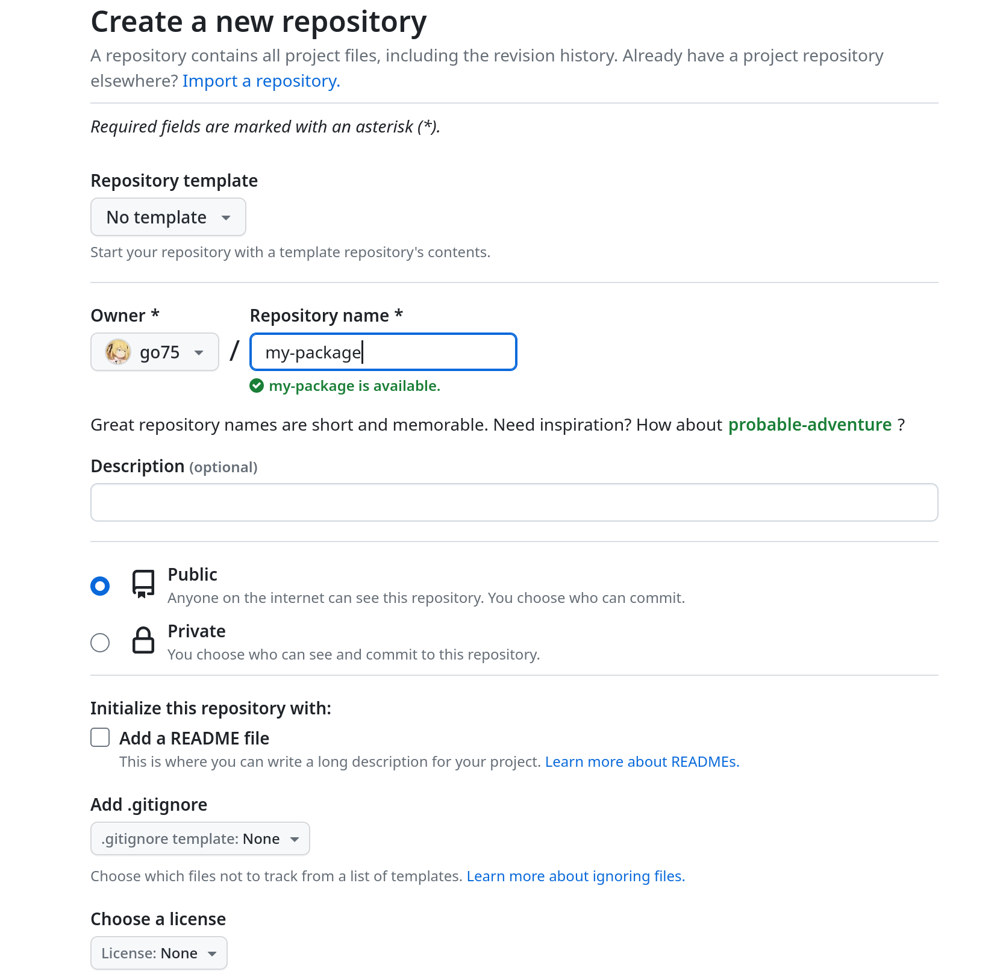
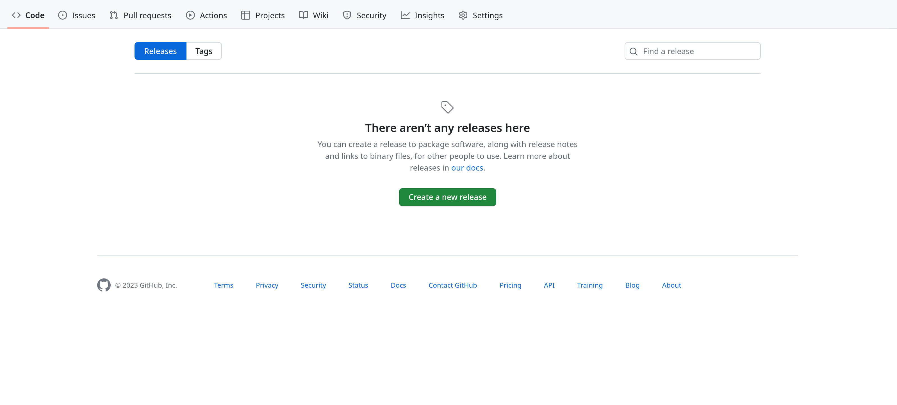
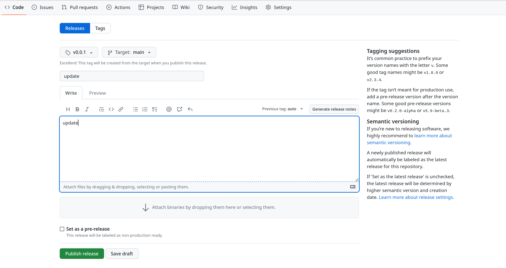
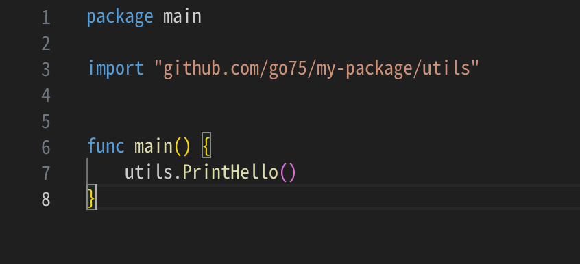

# GO语言篇之发布开源软件包

我们写GO语言程序的时候难免会引用第三方的软件包，那么你知道别人是怎么发布自己的软件包吗，别急，这篇博客教你怎么做

新建仓库


拉取到本地
```sh
git clone https://github.com/go75/my-package.git
```

初始化项目
```sh
go mod init github.com/go75/my-package.git
```

编写代码
```sh
mkdir utils
echo "
package utils

func PrintHello() {
    print("Hello")
}" > utils/hello.go
```

提交代码
```sh
git add .
git commit -m "update"
git push
```

发布



引用软件包

引用软件包
```sh
go get github.com/go75/my-package/utils
```



至此，少年你已经发布了第一个属于自己的GO语言开源软件包